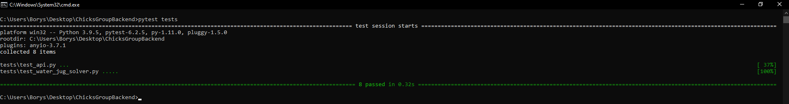

# Water Jug Problem Solver API

Welcome to the **Water Jug Solver API**, a robust and efficient solution built with FastAPI. 
This API addresses the classic Water Jug Problem, enabling users to determine the steps required to measure a specific amount of water using two jugs of given capacities. 
By leveraging actions such as filling, emptying, and transferring water between the jugs, the API provides a detailed sequence to achieve the target measurement.

## Table of Contents

- [Overview](#overview)
- [Features](#features)
- [Technology Stack](#technology-stack)
- [Setup and Installation](#setup-and-installation)
  - [Prerequisites](#prerequisites)
  - [Installation](#installation)
  - [Running the API](#running-the-api)
- [API Usage](#api-usage)
  - [Endpoint](#endpoint)
  - [Request Body](#request-body)
  - [Response Body](#response-body)
  - [Error Responses](#error-responses)
- [Project Structure](#project-structure)
- [Caching Mechanism](#caching-mechanism)
- [Testing](#testing)
- [Example Usage](#example-usage)
- [Notes](#notes)
- [Evaluation Criteria](#evaluation-criteria)
- [Learn More](#learn-more)

## Overview

The Water Jug Problem Solver API is designed to solve the classic puzzle where the objective is to measure a specific amount of water using only two jugs of given capacities. 
This API takes the capacities of the two jugs and the target amount as input and returns a step-by-step solution detailing the actions required to achieve the target measurement. 
It is built with FastAPI, ensuring high performance and scalability.

## Features

- **Solve Water Jug Problem:** Accepts jug capacities (X and Y) and target volume (Z) as inputs to determine the solution.
- **RESTful API Design:** Adheres to REST principles with appropriate HTTP methods for seamless integration.
- **JSON Responses:** Provides detailed sequences of actions or error messages in JSON format.
- **Efficient Algorithm Implementation:** Utilizes an optimized algorithm to determine necessary steps using fill, empty, and transfer actions.
- **Performance Optimization:** Implements in-memory caching to handle repeated requests swiftly.
- **Comprehensive Error Handling:** Validates inputs and provides meaningful error messages to guide users.
- **Testing:** Includes unit and integration tests to ensure correctness and reliability of the API.

## Technology Stack

- **Language:** Python 3.7+
- **Dependencies:** FastAPI, Pydantic, Uvicorn
- **Testing:** PyTest
- **Version Control:** Git

## Setup and Installation

### Prerequisites

- **Python 3.7 or later:** Ensure Python is installed on your system. You can download it from [python.org](https://www.python.org/downloads/).
- **FastAPI, Pydantic, and Uvicorn:** These packages are required for running the API.

### Installation

1. **Clone the Repository**
   ```bash
   git clone https://github.com/P4jMepR/ChicksGroupBackend.git
   ```
2. **Navigate to the Project Directory**
   ```bash
   cd ChicksGroupBackend
   ```
3. **Install Dependencies**
   
   For Windows:
   ```bash
   pip install -r requirements.txt
   ```
   For UNIX based systems:
   ```bash
   python3 -m pip iinstall -r requirements.txt
   ```
   *Note: Replace `pip` with `pip3` if necessary, depending on your Python installation.*

### Running the API

To start the API server, execute the following commands:

```bash
cd app
python main.py
```
or 
```bash
cd app
python3 main.py
```

This will launch the server on `http://127.0.0.1:8000`.

## API Usage

### Endpoint

**POST** `/api/solve`

**Description:** Solves the Water Jug Problem based on the provided jug capacities and target amount.

### Request Body

- **`x_capacity`** (int): Capacity of the first jug (must be a positive integer).
- **`y_capacity`** (int): Capacity of the second jug (must be a positive integer).
- **`z_amount_wanted`** (int): Target amount of water to be measured (must be a positive integer).

**Example Request:**
```json
{
    "x_capacity": 3,
    "y_capacity": 5,
    "z_amount_wanted": 4
}
```

### Response Body

- **`solution`**: A list of steps detailing the actions taken to reach the target amount.
  - **`step`** (int): Step number in the solution sequence.
  - **`bucketX`** (int): Amount of water in the first jug after this step.
  - **`bucketY`** (int): Amount of water in the second jug after this step.
  - **`action`** (str): Description of the action taken in this step.
  - **`status`** (str, optional): "Solved" if this is the final step in the solution.

**Example Response:**
```json
{
    "solution": [
        {"step": 1, "bucketX": 3, "bucketY": 0, "action": "Fill bucket X"},
        {"step": 2, "bucketX": 0, "bucketY": 3, "action": "Transfer from bucket X to bucket Y"},
        {"step": 3, "bucketX": 3, "bucketY": 3, "action": "Fill bucket X"},
        {"step": 4, "bucketX": 1, "bucketY": 5, "action": "Transfer from bucket X to bucket Y"},
        {"step": 5, "bucketX": 1, "bucketY": 0, "action": "Empty bucket Y"},
        {"step": 6, "bucketX": 0, "bucketY": 1, "action": "Transfer from bucket X to bucket Y"},
        {"step": 7, "bucketX": 3, "bucketY": 1, "action": "Fill bucket X"},
        {"step": 8, "bucketX": 0, "bucketY": 4, "action": "Transfer from bucket X to bucket Y", "status": "Solved"}
    ]
}
```

### Error Responses

- **400 Bad Request:** - Returned when no solution exists or if invalid inputs are provided.

**Example Error Response:**
```json
{
    "detail": "No solution"
}
```

## Project Structure

```
water-jug-solver-api/
├── app/
│   ├── main.py          # FastAPI application and API routes
├── tests/
│   ├── test_api.py      # Tests for API endpoints
│   ├── test_water_jug_solver.py # Tests for the solver algorithm
│   ├── conftest.py      # Test configuration and fixtures
│   └── __init__.py
├── requirements.txt     # Project dependencies
├── .gitignore           # Git ignore rules
├── .gitattributes       # Git attribute settings
├── README.md            # Project documentation
├── stress_test.py       # Script for performance testing
└── test_result.png      # Sample test results
```

## Caching Mechanism

To enhance performance, the API implements an in-memory caching mechanism. This cache stores previously computed solutions based on jug capacities and target amounts, ensuring that repeated requests with the same parameters are handled swiftly without redundant computations.

## Testing

Comprehensive testing ensures the reliability and correctness of the API:

- **Unit Tests:** Validate individual components and functions.
- **Integration Tests:** Ensure that different parts of the application work seamlessly together.
- **Stress Tests:** Assess the API's performance under high load conditions.

To run the tests, execute:
```bash
pytest test/
```



## Example Usage

1. **Start the API Server**
   ```bash
   python main.py
   ```
2. **Send a POST Request**
   ```bash
   curl -X POST "http://127.0.0.1:8000/api/solve" -H "Content-Type: application/json" -d '{"x_capacity": 3, "y_capacity": 5, "z_amount_wanted": 4}'
   ```
3. **Receive the Solution**
   The API will respond with a JSON object detailing the steps to achieve the target measurement.

## Notes

- **Input type:** Ensure all input values (`x_capacity`, `y_capacity`, `z_amount_wanted`) are positive integers. Negative or zero values will result in a 400 error.
- **Solution Existence:** If the target amount is larger than both jug capacities or if no valid sequence of actions exists, the API will return an error indicating that no solution exists.

## Evaluation Criteria

The Water Jug Problem Solver API has been developed with the following criteria in mind:

- **Adherence to Technical Requirements:** Complies with all specified technical guidelines.
- **Code Quality and Organization:** Maintains a clean, maintainable, and well-documented codebase.
- **Algorithm Efficiency:** Implements an optimized algorithm for solving the Water Jug Problem.
- **Performance Optimization:** Utilizes caching to improve response times for repeated requests.
- **Comprehensive Testing:** Includes thorough testing to ensure reliability and correctness.
- **Documentation:** Provides clear and detailed documentation to facilitate ease of understanding and use.

## Learn More

For more information about FastAPI and its features, visit the [FastAPI documentation](https://fastapi.tiangolo.com/)

For more information about the Water Jug Problem, visit this [GeeksForGeeks detailed article](https://www.geeksforgeeks.org/two-water-jug-puzzle/)
